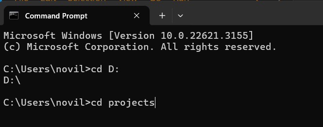
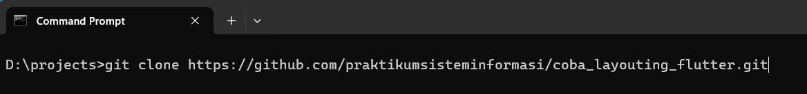
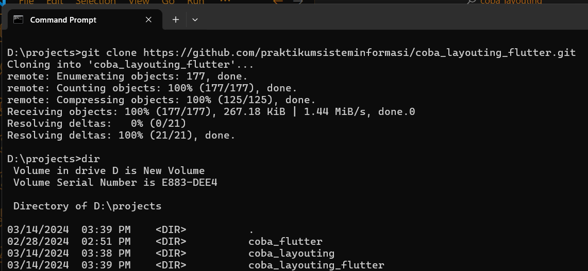

# Tutorial <i>clone</i>

1. Buka CMD, Git Bash, atau Windows Powershell, terus arahkan ke folder yang mau dipakai untuk naruh projectnya.
  <br><br>
  

2. Kalo sudah ada di folder yang dituju, ketikkan perintah:
    ```bash
    git clone https://github.com/praktikumsisteminformasi/coba_layouting_flutter.git
    ```
    

3. Nanti jadinya akan begini:
    <br><br>
    

# Menyiapkan project

1. Setelah di-*clone*, masuk ke folder projectnya, kita install package-package yang ada di *pubspec.yaml* dengan mengetikkan perintah:
   <br>
    ```bash
    flutter pub get
    ```